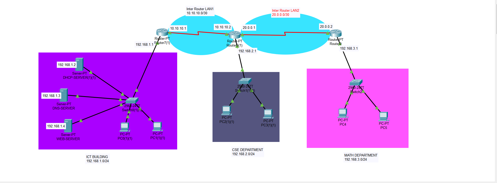

# Campus Network Project

This repository documents the implementation of a campus network topology that connects three main buildings: ICT Building, CSE Department, and Math Department. The project demonstrates network design, configuration, and testing using routers, servers, and workstations.

---
## Video Demo

  

Click the image or [here](https://youtu.be/uLn3TVJAxjs) to watch the video demonstration.

---
## Network Topology

The network consists of the following core components:
- **Three Buildings**: ICT Building, CSE Department, and Math Department.
- **Three Routers**: Router 1, Router 2, and Router 3 interconnecting the buildings.
- **Servers**:
  - **DHCP Server**: Handles dynamic IP address allocation.
  - **DNS Server**: Resolves domain names.
  - **Web Server**: Hosts a simple website.

### IP Addressing
- **Building LANs**:
  - ICT Building: `192.168.1.0/24`
  - CSE Department: `192.168.2.0/24`
  - Math Department: `192.168.3.0/24`
- **Inter-Router Links**:
  - Router 1 ↔ Router 2: `10.10.0.0/30`
  - Router 2 ↔ Router 3: `20.0.0.0/30`

---

## Configuration Highlights

### Static IPs
Static IPs are assigned to routers and servers to ensure stable communication:
- **Router 1**:
  - ICT LAN: `192.168.1.1`
  - Inter-router Link: `10.10.0.1`
- **DHCP Server**: `192.168.1.2`
- **DNS Server**: `192.168.1.3`
- **Web Server**: `192.168.1.4`

### DHCP Configuration
Three address pools are defined for dynamic IP allocation:
1. **Pool 1 (ICT Building)**:
   - Default Gateway: `192.168.1.1`
   - IP Range: Starting at `192.168.1.5`
   - Maximum Users: 20
2. **Pool 2 (CSE Department)**:
   - Default Gateway: `192.168.2.1`
   - IP Range: Starting at `192.168.2.2`
   - Maximum Users: 20
3. **Pool 3 (Math Department)**:
   - Default Gateway: `192.168.3.1`
   - IP Range: Starting at `192.168.3.2`
   - Maximum Users: 20

### DNS Configuration
- The DNS server resolves the domain `www.tahir.com` to the IP address `192.168.1.3`.

### Web Server Configuration
- Both HTTP and HTTPS services are enabled.
- A custom index page is served at `www.tahir.com`.

### Routing Information Protocol (RIP)
RIP is configured on all three routers to enable communication across the network:
- **Router 1**: Routes for `192.168.1.0` and `10.10.0.0`.
- **Router 2**: Routes for `192.168.2.0`, `10.10.0.0`, and `20.0.0.0`.
- **Router 3**: Routes for `192.168.3.0` and `20.0.0.0`.

---

## Demonstration

### Network Connectivity
- Successful communication between:
  - ICT Building ↔ CSE Department
  - ICT Building ↔ Math Department

### Web Server Access
- Verified accessibility of `www.tahir.com` from all PCs in the network:
  - ICT Building
  - CSE Department
  - Math Department

---

## Conclusion
This project demonstrates the design and implementation of a reliable campus network with efficient IP management, inter-department communication, and web services. The combination of static IP configurations and dynamic IP allocation ensures stability and scalability.

---
